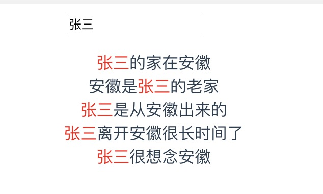
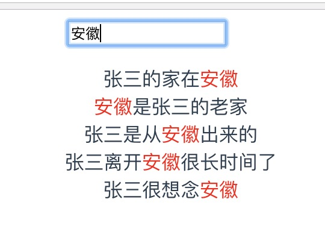

# vue 实时搜索高亮显示关键词 demo

> A Vue.js project

## Build Setup

``` bash
# install dependencies
npm install

# serve with hot reload at localhost:8080
npm run dev

# build for production with minification
npm run build

# build for production and view the bundle analyzer report
npm run build --report

# run unit tests
npm run unit

# run e2e tests
npm run e2e

# run all tests
npm test
```
## 博客网址: https://blog.csdn.net/qq_25403957/article/details/81111437

## 图片展示

